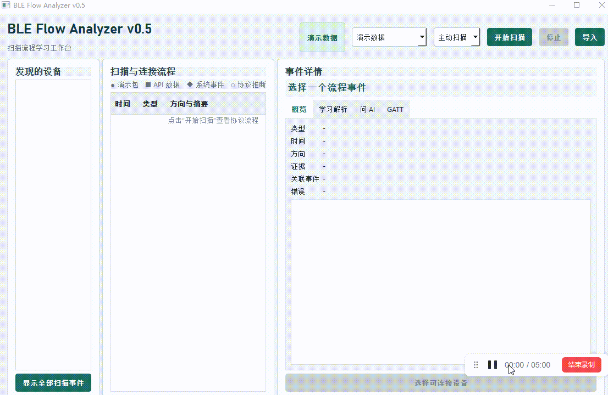

# BLE Flow Analyzer v0.5

当前版本：`0.5`，增加本地 Ollama、通义千问和 DeepSeek AI 问答。更多功能还在规划中。

当前版本仅支持 Windows 10 及更高版本。使用真实 BLE 扫描或连接功能前，请确认 Windows 蓝牙已经打开，并且系统已识别蓝牙适配器。

示图(demo.gif)如下：




面向 BLE 工程师学习协议的桌面流程分析工具。第一阶段已支持 Windows WinRT 真实扫描，并保留演示数据用于学习标准流程。不需要额外的 BLE 抓包硬件或抓包工具。


- 在“演示数据”和“真实 BLE”之间切换
- 通过 Windows WinRT Advertisement Watcher 扫描附近设备
- 区分 `ADV_IND`、`ADV_DIRECT_IND`、`ADV_NONCONN_IND`、`ADV_SCAN_IND`、`SCAN_RSP` 和扩展广播
- 主动扫描收到 `SCAN_RSP` 时插入明确标记为推断的 `SCAN_REQ`
- 设备列表稳定聚合广播结果
- 持续更新 RSSI、名称、Service UUID 和 Manufacturer Data
- 根据 API 字段重组 Advertising Data，不补造未提供的 Flags
- 将真实 API 数据、演示包、系统事件和协议推断明确区分
- `ADV_IND`、`SCAN_REQ`、`SCAN_RSP` 作为独立事件展示
- 选择设备后过滤时间线，同时保留扫描上下文
- 选择具体事件后查看重组 HEX、AD Structure 和学习说明
- 通过 Bleak 建立和主动断开真实连接
- 通过 WinRT 观察 Connection Interval、Peripheral Latency、Supervision Timeout 和 PHY
- 监听连接参数、PHY 和连接状态变化
- 区分主动断开与原因未暴露的远端/异常断开
- 连接成功后可显式发现 GATT Service、Characteristic 和 Descriptor
- 通过 Bleak 执行 Characteristic Read、Write 和 Notification 订阅/取消订阅
- 将实际 GATT Value HEX 记录到流程时间线
- 使用本地 Ollama、通义千问或 DeepSeek 对当前事件、HEX 和协议知识进行 AI 问答

## 安装和运行

如果使用发布目录中的程序，不需要安装 Python，直接运行：

```text
dist/BLEFlowAnalyzer_v0.5.exe
```

如果从源码运行，请先安装 Python 3.11 或更高版本，并在项目根目录执行：

```powershell
py -3.11 -m pip install -e .
```


在项目根目录可以直接运行：

```powershell
py -3.11 app.py
```

如果 `python` 命令指向已安装项目依赖的 Python 3.11，也可以运行：

```powershell
python app.py
```

也可以使用模块方式：

```powershell
py -3.11 -m ble_flow_analyzer
```


## 本地 AI 问答

AI 功能默认连接本机 Ollama：

```text
http://localhost:11434
```

首次使用时，请按下方步骤安装并启动 Ollama，再下载至少一个模型。


云端提供商需要 API Key：通义千问使用环境变量 `DASHSCOPE_API_KEY`，DeepSeek 使用环境变量 `DEEPSEEK_API_KEY`；也可以在当前对话框临时输入，关闭对话框后不会保存。

使用云端 AI 时，当前事件上下文可能包含设备名称、设备地址、UUID、Characteristic Value、HEX 和事件说明。发送前请检查上下文内容，不要提交敏感或不应离开本机的数据。

### Windows 安装 Ollama

Ollama 要求 Windows 10 或更高版本。推荐从 [Ollama Windows 下载页](https://ollama.com/download/windows) 下载 `OllamaSetup.exe` 并完成安装。

也可以在 PowerShell 中使用官方安装脚本：

```powershell
irm https://ollama.com/install.ps1 | iex
```

安装后重新打开 PowerShell，确认命令可用：

```powershell
ollama --version
```

Windows 桌面版通常会自动在后台启动 Ollama。若本地服务没有运行，可以手动启动：

```powershell
ollama serve
```

运行 `ollama serve` 的窗口需要保持打开。若提示端口 `11434` 已被占用，通常表示 Ollama 已经在后台运行，不需要重复启动。

### 下载模型

推荐使用 `qwen2.5:1.5b`，它在回答质量和本机资源占用之间相对均衡：

```powershell
ollama pull qwen2.5:1.5b
```

资源较有限时，也可以安装更小、更快的模型：

```powershell
ollama pull qwen2.5:0.5b
```

查看已经安装的模型：

```powershell
ollama ls
```

可以先在终端中测试模型：

```powershell
ollama run qwen2.5:1.5b
```

看到输入提示后输入问题；使用 `/bye` 退出对话。


## 数据边界

真实模式展示的是 Windows WinRT 和 Bleak 提供的 API 数据，不是完整的 BLE 空口抓包。工具不会提供 Preamble、Access Address、完整 Link Layer Header、CRC、信道或重传等原始空口信息；部分 `SCAN_REQ` 和连接流程内容属于协议推断或学习说明。

## 免责声明与许可

本工具仅供调试你自有的 BLE 设备。使用者须自行确保使用符合当地无线电、射频和其他适用法规。软件按“现状”提供，不作任何担保。

详见 [DISCLAIMER.md](DISCLAIMER.md) 和 [LICENSE](LICENSE)。

## 问题反馈

如遇到问题，请提交 Issue，或发送邮件至 [fanqiefox@foxmail.com](mailto:fanqiefox@foxmail.com)